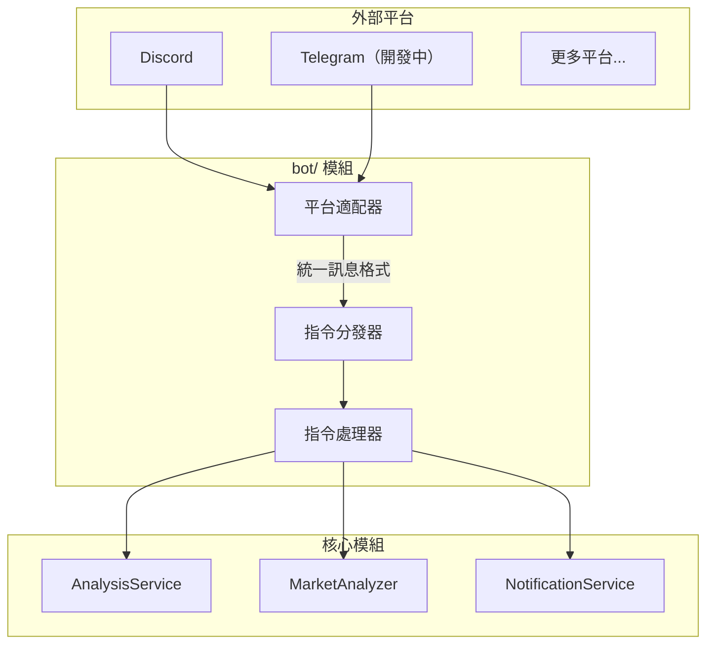

## 一、整體設計



## 二、目錄結構

```
bot/
├── __init__.py             # 模組入口，匯出主要類別
├── models.py               # 統一的訊息／回應模型
├── dispatcher.py           # 指令分發器（核心）
├── handler.py              # Webhook 處理入口
├── commands/               # 指令處理器
│   ├── __init__.py
│   ├── base.py             # 指令抽象基類
│   ├── analyze.py          # /analyze 股票分析
│   ├── ask.py              # /ask 對話式分析
│   ├── batch.py            # /batch 批量分析
│   ├── chat.py             # /chat 對話
│   ├── market.py           # /market 大盤復盤
│   ├── help.py             # /help 說明資訊
│   └── status.py           # /status 系統狀態
└── platforms/              # 平台適配器
    ├── __init__.py
    ├── base.py             # 平台抽象基類
    └── discord.py          # Discord 機器人
```

## 三、核心抽象設計

### 3.1 統一訊息模型 (`bot/models.py`)

```python
@dataclass
class BotMessage:
    """統一的機器人訊息模型"""
    platform: str           # 平台標識: discord/telegram
    user_id: str            # 發送者 ID
    user_name: str          # 發送者名稱
    chat_id: str            # 對話 ID（群聊或私聊）
    chat_type: str          # 對話類型: group/private
    content: str            # 訊息文字內容
    raw_data: Dict          # 原始請求資料（平台專屬）
    timestamp: datetime     # 訊息時間
    mentioned: bool = False # 是否 @ 了機器人

@dataclass
class BotResponse:
    """統一的機器人回應模型"""
    text: str               # 回覆文字
    markdown: bool = False  # 是否為 Markdown
    at_user: bool = True    # 是否 @ 發送者
```

### 3.2 平台適配器基類 (`bot/platforms/base.py`)

```python
class BotPlatform(ABC):
    """平台適配器抽象基類"""

    @property
    @abstractmethod
    def platform_name(self) -> str:
        """平台標識名稱"""
        pass

    @abstractmethod
    def verify_request(self, headers: Dict, body: bytes) -> bool:
        """驗證請求簽名（安全校驗）"""
        pass

    @abstractmethod
    def parse_message(self, data: Dict) -> Optional[BotMessage]:
        """解析平台訊息為統一格式"""
        pass

    @abstractmethod
    def format_response(self, response: BotResponse) -> Dict:
        """將統一回應轉換為平台格式"""
        pass
```

### 3.3 指令基類 (`bot/commands/base.py`)

```python
class BotCommand(ABC):
    """指令處理器抽象基類"""

    @property
    @abstractmethod
    def name(self) -> str:
        """指令名稱（如 'analyze'）"""
        pass

    @property
    @abstractmethod
    def aliases(self) -> List[str]:
        """指令別名（如 ['a', '分析']）"""
        pass

    @property
    @abstractmethod
    def description(self) -> str:
        """指令描述"""
        pass

    @abstractmethod
    async def execute(self, message: BotMessage, args: List[str]) -> BotResponse:
        """執行指令"""
        pass
```

## 四、已支援的指令

| 指令 | 別名 | 說明 | 範例 |
|------|------|------|------|
| /analyze | /a, 分析 | 分析指定股票 | `/analyze AAPL` |
| /ask | — | 對話式分析（含策略） | `/ask AAPL 用纏論分析` |
| /market | /m, 大盤 | 大盤復盤 | `/market` |
| /batch | /b, 批量 | 批量分析自選股 | `/batch` |
| /help | /h, 說明 | 顯示說明資訊 | `/help` |
| /status | /s, 狀態 | 系統狀態 | `/status` |

## 五、設定

在 `.env` 中設定機器人相關參數：

```
# Discord 機器人
DISCORD_BOT_TOKEN=
DISCORD_MAIN_CHANNEL_ID=
DISCORD_WEBHOOK_URL=
```

## 六、擴充說明

### 新增通知平台

1. 在 `bot/platforms/` 建立新檔案
2. 繼承 `BotPlatform` 基類
3. 實作 `verify_request`、`parse_message`、`format_response`

### 新增指令

1. 在 `bot/commands/` 建立新檔案
2. 繼承 `BotCommand` 基類
3. 實作 `execute` 方法
4. 在分發器中註冊指令

## 七、安全設定

- 支援指令頻率限制（防刷）
- 敏感操作（如批量分析）可設定權限白名單

```python
bot_rate_limit_requests: int = 10     # 頻率限制：窗口內最大請求數
bot_rate_limit_window: int = 60       # 頻率限制：窗口時間（秒）
bot_admin_users: List[str] = []       # 管理員使用者 ID 列表
```
